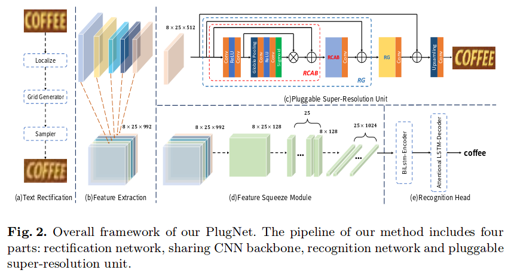

# PlugNet: Degradation Aware Scene Text Recognition Supervised by a Pluggable Super-Resolution Unit

This repository implements the PlugNet in pytorch. Thanks for [ayumiymk](https://github.com/ayumiymk), the base of our code is from [aster.pytorch](https://github.com/ayumiymk/aster.pytorch).

PlugNet combines the pluggable super-resolution unit (PSU) to solve the low-quality text recognition from the feature-leve. The research paper can be found [here](https://www.ecva.net/papers/eccv_2020/papers_ECCV/papers/123600154.pdf).



## Train

```
bash scripts/main_train.sh
```

## Test

```
bash scripts/main_test_all.sh
```

## Reproduced results

|               | IIIT5k |  SVT |  IC03 |  IC13 |  SVTP |  CUTE |
|:-------------:|:------:|:----:|:-----:|:-----:|:-----:|:-----:|
| ASTER.Pytorch |  93.2  | 89.2 | 92.2  |   91  |  81.2 |  81.9 |
| Aster(our training) |  93.4  | 89.5 | 94.5  |   91.8  |  78.5 |  79.5 |
| PlugNet |  94.4  | 92.3 | 95.7  |   95.0  |  84.3 |  85.0 |


You can use the codes to bootstrap for your next text recognition research project.


## Data preparation

We give an example to construct your own datasets. Details please refer to `lib/tools/create_svtp_lmdb.py`.

Our training and testing data refer to [aster.pytorch](https://github.com/ayumiymk/aster.pytorch).

## Citation

If you find this project helpful for your research, please cite the following papers:

```
@article{eccv2020plugnet,
  author  = {Yongqiang Mou and
               Lei Tan and
               Hui Yang and
               Jingying Chen and
               Leyuan Liu and
               Rui Yan and
               Yaohong Huang},
  title   = {PlugNet: Degradation Aware Scene Text Recognition Supervised by a Pluggable Super-Resolution Unit},
  journal = {The 16th European Conference on Computer Vision (ECCV 2020), 2020.}, 
  volume  = {}, 
  number  = {}, 
  pages   = {1-17},
  year    = {2020}, 
}
```

IMPORTANT NOTICE: Although this software is licensed under MIT, our intention is to make it free for academic research purposes. If you are going to use it in a product, we suggest you [contact us](huiyang865@hotmail.com) regarding possible patent issues.